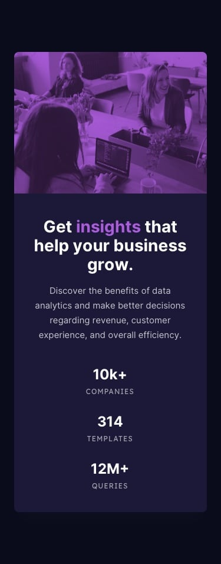

Frontend Mentor - Stats preview card component solution
This is a solution to the Stats preview card component challenge on Frontend Mentor. Frontend Mentor challenges help you improve your coding skills by building realistic projects.

Screenshots:
  

Links
Solution URL:(https://github.com/ysmltr/Stats-preview-card-component.git)
Live Site URL: (https://stats-preview-card-component-blond.vercel.app)
My process
Built with
Semantic HTML5 markup
CSS custom properties
Flexbox
CSS Grid
What I learned
Built with -HTML

-CSS Flexbox

What I learned

How to make a media section:

    /* Media Queries for Mobile */

    @media only screen and (max-width: 768px) {
      .container {
        max-width: 100%;
      }
    
      .left-section {
        grid-template-columns: 1fr;
      }
    
      .text-section {
        padding: 10px;
      }
    
      h1 {
        font-size: 1.5rem;
      }
    
      .info,
      .stats p {
        font-size: 1rem;
      }
    
      .stats {
        display: block;
        flex-direction: column;
        align-items: center;
      }
    
      .stats .items {
        margin: 30px 0;
        text-align: center;
      }
      .items .header{
        font-size: 25px;
      }
    }

 How to make a responsive design with css flexbox and the basic uses of html and css. viewing your solution or for yourself when you look back on this project in the future.

Author
Website -[@yesimilter] https://yesimilter.me  
Frontend Mentor - [@ysmltr](https://www.frontendmentor.io/profile/ysmltr) 
Twitter - [@yesimltr](https://twitter.com/yesimltr) 